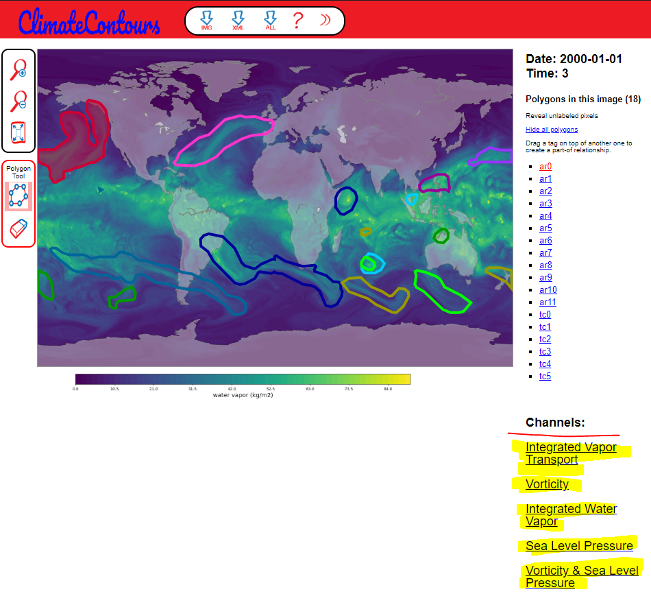

[ClimateContours](https://gmd.copernicus.org/preprints/gmd-2020-72/) ClimateContours tool, based on
[LabelMe](http://labelme.csail.mit.edu) source code
===========

This readme will instruct you to deploy ClimateContours with your own dataset,
and introduce you to some preliminary visualization and processing methods for the
label data you may generate.

ClimateContours is an annotation tool writen in
Javascript for online image labeling. The advantage with respect to
traditional image annotation tools is that you can access the tool
from anywhere and people can help you to annotate your images without
having to install or copy a large dataset onto their computers.

### CITATION:
   
   This readme, and the ClimateContours tool credits the open source work of

   B. C. Russell, A. Torralba, K. P. Murphy, W. T. Freeman.
   LabelMe: a Database and Web-based Tool for Image Annotation.
   International Journal of Computer Vision, 77(1-3):157-173, 2008. 
   [Project page](http://labelme.csail.mit.edu)


### CONTENTS:

* Images - This is where your images go.
* Annotations - This is where the annotations are collected.
* visualization - Pythonic scripts for generating jpg and xml data. **See internal README.md.**
* tool.html - Main web page for LabelMe annotation tool.
* annotationTools - Directory with source code.
* annotationCache - Location of temporary files.
* Icons - Icons used on web page.
* DockerFiles - Directory with Docker files for installation via Docker.


### QUICK START (LOCAL INSTANCE) INSTRUCTIONS:

1. **Put LabelMe annotation tool code on web server (see web server
   configuration requirements below).**

2. On the command line run:

   ``` sh
   $ make
   ```

   This will set a global variable that the perl scripts
   need.  ***Note*** If you move the location of the code, then you
   need to re-run "make" to refresh the global variable.

3. Create a subfolder inside the "Images" folder and place your images
   there.  For example: "Images/example_folder/img1.jpg".  Make sure
   all of your images have a ".jpg" extension and the
   folders/filenames have alphanumeric characters (i.e. no spaces or
   funny characters).

4. Point your web browser to the following URL: 

  127.0.0.1/climatecontours_edit_labels/tool.html

5. Label your image.  Press "show me another image" to go to the next
   image in the folder.

6. Voila!  Your modified annotations will appear at `climatecontours_edit_labels\submittedAnnotations\tmq`. This target can be changed in `climatecontours_edit_labels\annotationTools\perl\submit.cgi`


### WEB SERVER START INSTRUCTIONS:

You will need the following to set up the LabelMe tool on your web
server:

* **Run an Apache server (see special configuration instructions for
  [Ubuntu](UBUNTU_16_04.md) or [Windows](WINDOWS.md)).**
  
If you run into issues after the linked instructions above, please try:

* Enable authconfig in Apache so that server side includes (SSI) will
  work. This will allow SVG drawing capabilities. This is the most
  common source of errors, so make sure this step is working.
* Allow perl/CGI scripts to run.  This is the second most common
  source of errors.
* Make sure the php5 and libapache2-mod-php5 libraries are
  installed. You can install them on Linux by running the following:

   ``` sh
   $ sudo apt-get install php5 libapache2-mod-php5
   ```

* (Optional) See special configuration instructions if you are
  installing on [Ubuntu](UBUNTU.md) or [Windows](WINDOWS.md).

If you are not able to draw polygons, check to see if the page is
loaded as an "application/xhtml+xml" page (you can see this in
Firefox by navigating to Tools->Page Info). If it is not, be sure
that SSI are enabled (see above for enabling authconfig in Apache).

Make sure that your **images have read permissions** on your web server
and **folders in the "Annotations" folder have write permissions**. Also,
"annotationCache/TmpAnnotations" needs to have write permissions.

### PRE-LOADING ANNOTATIONS (For QA on existing annotations):

* the script populate_dirlist.sh will inform the tool what xmls should be rendered alongside any given image. Any xml files at `climatecontours_edit_labels\Annotations\tmq\` will be detected and loaded with .jpg files with the exact same name in `climatecontours_edit_labels\Images\tmq`.

   ``` sh
   $ cd ./annotationTools/sh/
   $ ./populate_dirlist.sh
   ```
  This will create a list of all images inside the "./Images" folder,
  and will appear inside the file "./annotationCache/DirLists/labelme.txt".

* You can then adjust the labeling of these images at
http://127.0.0.1/climatecontours_edit_labels/tool.html.
  
### LOADING MULTIPLE IMAGES PER SEGMENTATION TASK
  
  Following this example setup of the tool:
  
  
  
  See bottom of right hand sidebar: user can choose between IVT, Vorticity, IWV, PSL... view for the single labeling task
  
  To achieve this for your own layers, manually edit:
  * `toggle_list` in `annotationTools/js/globals.js` 
  * Hard coded color bars stored in `Icons/`
  * Hard coded color bar references in `annotationTools/js/object_lists.js` func `GoesToChannels()`
  * Hard coded color bar references in `annotationTools/js/my_scripts.js` func `Toggle()`

  You can create a collection consisting of a particular folder by
  running the following from the command line:

   ``` sh
   $ cd ./annotationTools/sh/
   $ ./populate_dirlist.sh my_collection.txt example_folder
   ```

  The list will appear inside
  "./annotationCache/DirLists/my_collection.txt".  You can then
  label images inside the collection using the following URL:

   http://127.0.0.1/climatecontours_edit_labels/tool.html

* You can change the layout of the annotation files for your
  collection by modifying the XML file template inside of
  "./annotationCache/XMLTemplates/your_collection.xml".  The default
  template is "./annotationCache/XMLTemplates/labelme.xml".

* A log file of the annotation tool actions are recorded in
  "./annotationCache/Logs/logfile.txt".  Make sure that this file has
  write permissions.

### ADVANCED FEATURES OF THE ANNOTATION TOOL:

* The following are URL variables you can pass to the annotation tool:

N.B. All `scribble`  functionality has been disabled do to backend instability
   
   * mode=im - Only show the image and drawing canvas (do not show anything outside of the image.
   * mode=mt - Mechanical Turk mode.
   * mode=f - Pressing "next image" button goes to next image in the folder.
   * mode=i - Pressing "next image" button goes to random image in the default LabelMe collection.
   * mode=c - Go to next image in the collection (set via the dirlist).
   * username=johndoe - Sets username for labeling session.
   * collection=LabelMe - Uses the default LabelMe collection list. See below for setting up a new collection list.
   * folder=MyLabelMeFolder - LabelMe folder where the image lives.
   * image=image.jpg - LabelMe image to annotate.
   * objects=car,person,building - When popup bubble appears asking the user for the object name, the user selects one of these objects appearing as a drop-down list.
   * objlist=visible - This controls whether the object list on the right side is visible or not. Use "objlist=hidden" to make it hidden.
   * actions=n - Control what actions the user is allowed to do. To set the desired actions, use any combination of the letters below. For example, to allow renaming, modify control points, and delete actions, then set "actions=rmd". By default, "actions=n". The following are possible actions:
      * n - create and edit new polygons
      * r - rename existing objects
      * m - modify control points on existing objects
      * d - delete existing objects
      * a - allow all actions
      * v - view polygons only (do not allow any editing)
   * viewobj=e - Control which objects the user sees. Use one of the following possible options below. By default, "viewobj=e". Note that for deleted objects, these will be shown in gray and the object name in the object list will be italicized.
      * e - view new and previously labeled objects
      * n - view new objects only
      * d - view new and deleted objects
      * a - view all objects (new, existing, deleted)

   The following are for Mechanical Turk mode:

   * mt_sandbox=true - Use Mechanical Turk sandbox mode. This mode is used for debugging on Mechanical Turk. You may want to start with this variable set to make sure everything works.
   * N=5 - The worker is required to label at least 5 polygons. Use N=inf to allow the worker to label as many as they want.
   * mt_intro=http://yourpage.com - You may customize the instructions that the worker sees. By default, the following [instructions](http://labelme2.csail.mit.edu/Release3.0/annotationTools/html/mt_instructions.html) are given to the workers.
   * mt_instructions=Place your instructions here - You may customize the one-line instructions that the worker sees at the top of the labeling task. By default, the instructions are: Please label as many objects as you want in this image.


### CODE API:

The following is a brief overview of the source code.  Please see the
[Javascript code API](https://cdn.rawgit.com/CSAILVision/LabelMeAnnotationTool/master/annotationTools/js/api/index.html)
for more details.

* tool.html - This is the entry point for the annotation tool.  The main
functionality is to insert all of the javascript code and lay down the
drawing canvases.

* annotationTools/js/ - This folder contains all of the javascript
code for the annotation tool functionalities.
We provide the [code API](https://cdn.rawgit.com/CSAILVision/LabelMeAnnotationTool/master/annotationTools/js/api/index.html)
for the Javascript source code, which has been automatically extracted
from the source code comments.

* annotationTools/perl/ - This folder contains all of the Perl
scripts used for communication with the server back-end.

* annotationTools/css/ - This folder contains all of the CSS style
definitions.

* annotationTools/html/ - This folder contains auxillary HTML files
(e.g. for Mechanical Turk instructions, etc.).


---- 

